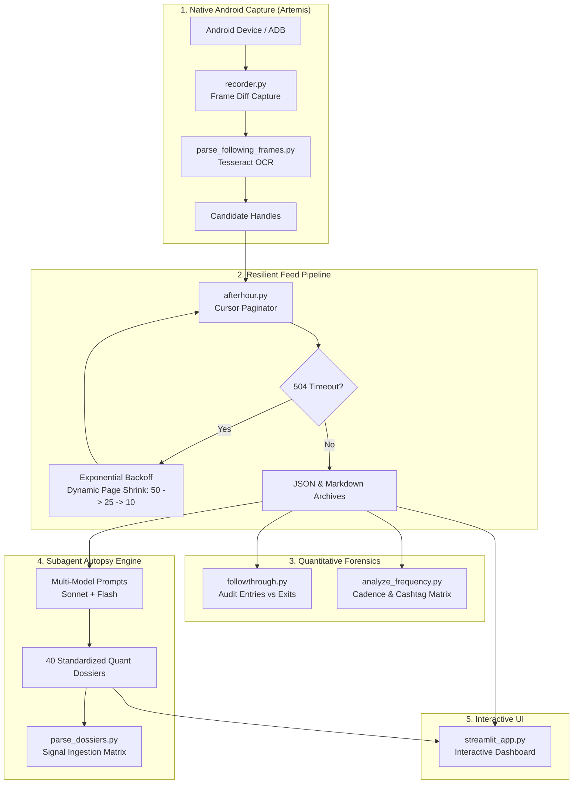

# 🧬 AfterMath: AfterHour Forensic Autopsy & Signal Intelligence Engine

> Conducting quantitative forensic autopsies on retail social trading feeds. Measuring the disclosure gap, auditing follow-through reality, and extracting mechanical signal flow across 33,000+ posts.

[](tests/)
[](pyproject.toml)
[](LICENSE)

---

## 🎯 The Core Thesis: In Data We Trust

Have you ever decided somebody could trade based on one screenshot? Have you ever unfollowed a trader over a bad call in a week you were also wrong? Have you ever trusted the loudest account in the room because they were hilarious on a green day?

We stopped grading traders by vibe. Using **Artemis** (autonomous Android device automation) and AfterHour's public feed architecture, we pulled the complete lifetime post history of **40 followed traders**—not a sample, not the green months, but all **33,090 posts** from day one to the present.

Then we ran every trader through a standardized, unsparing forensic autopsy:

```text
You are a senior quantitative trading analyst conducting a deep forensic
autopsy on AfterHour trader @{username} (#{rank} most active followed
trader with {lifetime_posts} lifetime posts).

Read through their lifetime posts and conduct a quantitative, mechanical,
and psychological breakdown:
1. Executive Profile: Trader philosophy, post cadence, active timeline.
2. Ticker Universe & Catalysts: Core assets, options vs equities, macro vs technical.
3. Risk Management & PnL Reality: Profit-taking vs bag-holding, documented wins vs blow-ups.
4. Behavioral & Sentiment Signals: Linguistic tells, reaction to volatility and red days.
5. Quantitative Verdict:
   - Algorithmic Classification Tags
   - Algorithmic Alpha Score (0 to 100) & Expectancy
   - Signal Flow Ingestion Matrix (INGEST, FADE, FIREWALL, EXIT rules)
6. Chronological Milestone & Catalyst Log.
```

Three variables change between runs: the handle, the rank, and the post count. Nobody gets a softball. The trader with 2,682 posts and the trader with 57 posts face the identical interrogation.

---

## 📊 The Numbers: The Disclosure Reality

When you strip away self-reported brokerage syncs (which glitch on illiquid option marks, capital deposits, and unlinking events) and measure what traders **actually write**, the true anatomy of retail social trading appears:

```
Positions announced as buys          3,660
Ever closed in public                1,739   (47.5%)
Never mentioned again as an exit     1,921   (52.5%)

Entry-language posts                 7,682
Exit-language posts                  4,948   (1.55 entries per exit)

Posts tagged Gain                    2,765
Posts tagged Loss                      233   (11.87 gains per loss)
```

### 1. The Missing Exit (52.5% Phantom Rate)
**52.5% of every position announced as a buy simply never gets a closing post.** It is never sold, never stopped out, and never admitted. The trade doesn't conclude; it just goes quiet. That silence is the empirical signature of a bagholder.

### 2. The 11.87:1 Gain/Loss Illusion
Traders post **11.87 gains for every 1 loss**. Across two and a half years of mixed market regimes, retail traders are not 12 times better at trading than they are bad at it. That number is not a performance record—it is a **disclosure filter**.

### 3. The LLM Scoring Hallucination
When identical prompts and post datasets were evaluated across two frontier models, the **mean absolute score disagreement was 32.3 points**:

```
                    First Pass    Second Pass    Delta
@RyanLP                 89            14          -75
@terridactil            84            24          -60
@MarketVictor           88            31          -57
@mphinance              92            58          -34
@Drone_Daddy            72            41          -31
@AtypicallyErect        64            34          -30
@883Ismygovtname        79            58          -21
@Legitimate_Risk        68            58          -10
@NewFishBigPond         24            24            0
@Freeballer             18            33          +15
@Dallaslongcall         12            34          +22
```

Across all 40 traders, the correlation between an AI's confidence score and the trader's actual real-world follow-through rate was **0.20**. An AI scoring prompt doesn't measure edge; it measures how persuasive the trader's prose sounds.

---

## ⚡ What Actually Survived: The Signal Flow Ingestion Matrix

The scores went in the trash. What survived was **mechanical behavioral extraction**:

```
@Tiger_
Classification: FUNDAMENTAL_QUALITY_COMPOUNDER / LEVERAGED_CONTRARIAN_DIP_BUYER

INGEST    Auto-tag any ticker moved above 10% disclosed portfolio weight
          as a high-quality candidate for fundamental verification.
          Rare, explicit "leverage on" declarations act as a contrarian
          bottom signal on market-wide risk sentiment.
FADE      Fade trim and rotation timing specifically, not stock selection.
FIREWALL  Zero stop-loss discipline. Single names routinely run 20-50%
          of book value.
EXIT      Tiered mechanical trim: bank 1/3 at +50%, 1/3 at +100%, trail rest.
```

```
@Tradeless
Classification: PERMA_BEAR_MACRO_HEDGER / THEMATIC_LIST_AGGREGATOR

INGEST    Scrape thematic sector watchlists as an ideation screener feed.
FADE      Treat clusters of bearish index-put disclosures during uptrends
          as sentiment-extreme exhaustion tells.
FIREWALL  Never ingest sizing, entry mechanics, or stop-loss placement.
          Hard-blacklist instrument class: uncapped-size 0DTE index options.
```

*"Harvest his watchlist, never his sizing"* is actionable alpha. *"He scored an 82"* is meaningless noise.

---

## 🏗️ System Architecture



---

## 📂 Repository Layout

```
aftermath/
├── afterhour.py                 # Resilient public feed API client & cursor paginator
├── followthrough.py             # Forensic entry-vs-exit followthrough calculator
├── download_single_trader_lifetime.py # CLI: Download 100% lifetime history for a handle
├── download_markdown_dossiers.py# CLI: Batch sequential post archiver
├── parse_dossiers.py            # Extracts structured cards from quant dossiers
├── analyze_frequency.py         # Velocity and posting cadence auditor
├── recalc_real_frequency.py     # 7D / 30D volume recalculation
├── split_active_following.py    # Segregates active vs dormant accounts
├── recorder.py                  # Artemis ADB screen capture recorder
├── parse_following_frames.py    # OpenCV/Tesseract frame OCR parser
├── streamlit_app.py             # Streamlit visual exploration dashboard
├── data/
│   ├── following/               # 40 Complete raw JSON archives (*_all_posts.json)
│   └── samples/                 # Sample multi-thousand post fixtures
├── reports/
│   ├── dossiers/                # 40 In-depth forensic quant dossiers
│   │   └── sonnet/              # Frontier model benchmark comparisons
│   ├── posts/                   # Complete markdown archives of 33,090 posts
│   └── analysis/                # followthrough.json, verdicts_*.json, Substack essay
└── tests/                       # Unit tests (100% mocked, zero network reliance)
```

---

## 🚀 Quickstart

### 1. Installation

```bash
git clone https://github.com/mphinance/aftermath.git
cd aftermath
pip install -r requirements.txt
```

### 2. Run the Follow-Through Forensic Autopsy

Recompute the disclosure rates, gain/loss ratios, and exit discipline across all 40 accounts:

```bash
python3 followthrough.py
```

### 3. Download Any Trader's Lifetime Post History

Extract every public post from day one into structured JSON and Markdown:

```bash
python3 download_single_trader_lifetime.py <username>
```

### 4. Launch the Interactive Dashboard

```bash
streamlit run streamlit_app.py
```

Features:
- Full posting cadence heatmaps (day of week vs hour of day)
- Cashtag / ticker distribution graphs
- Tag breakdown (Gain vs Loss vs DD vs YOLO)
- Full unvarnished data table with instantaneous CSV export

### 5. Run Unit Tests

```bash
pytest tests/test_afterhour.py
```

---

## 📜 License

MIT License. In data we trust.
