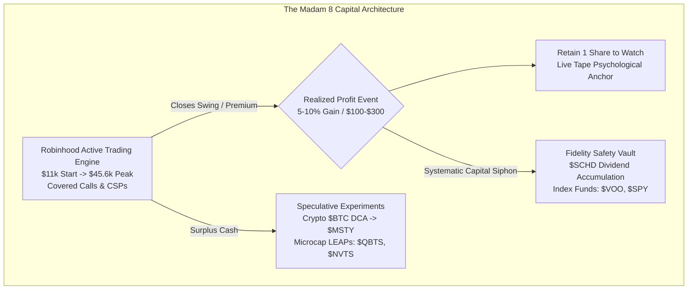
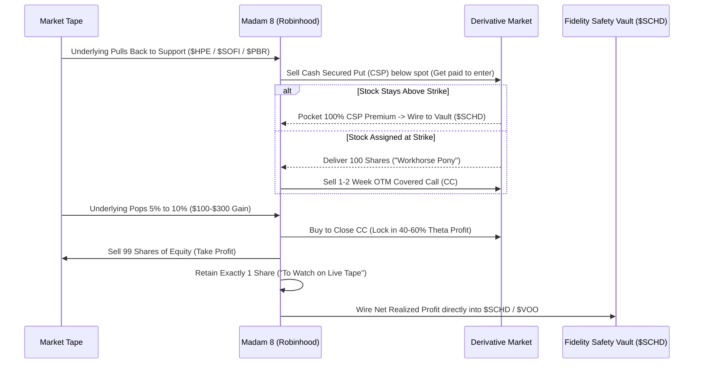
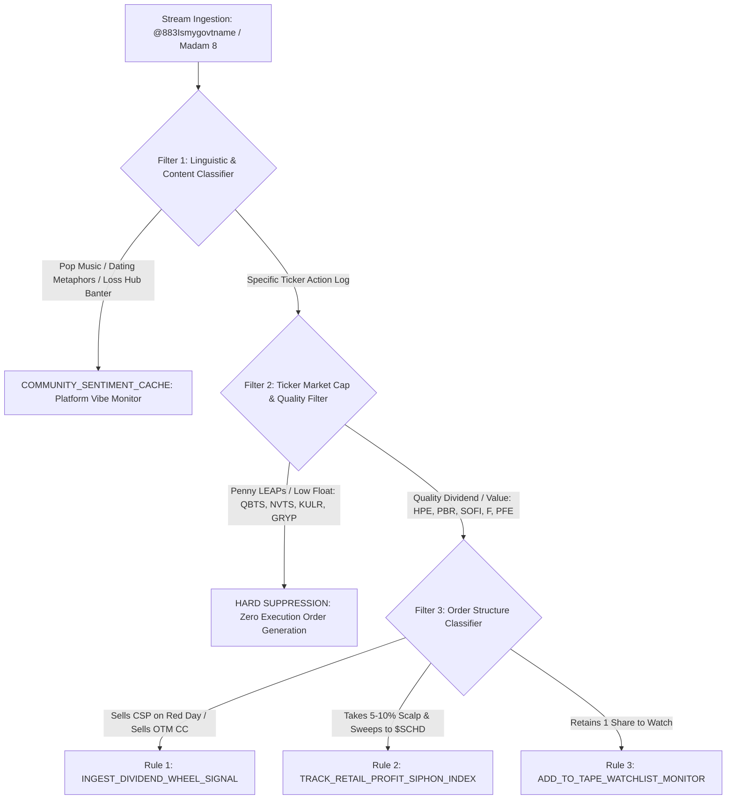

# Quantitative Dossier: @883Ismygovtname

```
+-------------------------------------------------------------------------------------------------------+
| TRADER PROFILE: @883Ismygovtname ("Madam 8")                                                         |
+--------------------------------+----------------------------------------------------------------------+
| Field                          | Forensic Evaluation                                                  |
+--------------------------------+----------------------------------------------------------------------+
| Target Handle                  | @883Ismygovtname (Self-styled: "Madam 8" / "Madam 883")              |
| Platform Profile               | https://afterhour.com/883Ismygovtname                                 |
| Author ID                      | prf_494db31cac014f97888a761284ee1667                                 |
| AfterHour Network Standing     | #6 Most Active Followed Trader (2,374 Lifetime Posts)                 |
| Active Operational Window      | 2024-11-15 to 2026-09-10 (664 Calendar Days / 94.9 Weeks)            |
| Lifetime Cumulative Footprint  | 148,587 Views · 9,989 Reactions · 10,857 Comments                     |
| Mean Engagement / Post         | 62.6 Views · 4.2 Reactions · 4.6 Comments (Max: 81 Rx, 92 Cm)        |
| Primary Asset Class            | Equity Derivatives & Equities (The Wheel, Covered Calls, CSPs, LEAPs)|
| Primary Strategy Core          | Covered Call Cashflow Farming & Systematic Dividend Siphoning ($SCHD) |
| Peak Cadence Velocity          | 46.2 posts/week (Oct 2025: 204 posts; Dec 2024: 168 posts)           |
| Current / Recent Cadence       | 13.0 posts/week (Last 7 Days: 13 posts; Last 30 Days: 50 posts)       |
| Baseline Lifetime Average      | 25.02 posts/week (3.57 posts/day lifetime average)                   |
| Verified Capital Baseline      | $6,068.49 (Nov 2024) -> $45,686.57 (Jun 2025 Verified Peak; +652.8%) |
| Verified Peak-to-Trough DD     | -46.01% ($35,472.95 down to $19,151.97 in Apr 2025; Full Recovery)   |
| Plaid Portfolio Sync Status    | Unlinked on 2025-06-30 (Post #854); Operating in Self-Reported Stealth|
| Capital Siphon Vehicle         | $SCHD (Schwab US Dividend Equity ETF) + Unlinked Fidelity Index Vault |
| Documented Gain/Loss Tags      | 4 Tagged Wins / 1 Tagged Loss (Self-reported: 684 Win vs 86 Loss msgs)|
| Primary Algorithmic Tag        | RETAIL_DIVIDEND_VALUE_ACCUMULATOR                                    |
| Secondary Algorithmic Tag      | THE_WHEEL_MICRO_HARVESTER & COMMUNITY_SENTIMENT_ANCHOR               |
| TraderMatrix Engine Directive  | INGEST_WHEEL_CANDIDATES + SUPPRESS_PENNY_LEAPS + TRACK_SCHD_SIPHON   |
+--------------------------------+----------------------------------------------------------------------+
```

---

## 1. Executive Profile & Capital Trajectory

### 1.1 The Archetype: The Covered Call Cashflow Farmer & Dividend Siphon
`@883Ismygovtname` (known across the AfterHour ecosystem as **"Madam 8"** or **"Madam 883"**) represents the single most disciplined micro-capital compounding loop in retail finance. While the vast majority of social trading participants suffer from terminal leverage addiction, directional gambling, and round-trip account blow-ups, Madam 8 executes a systematic, blue-collar wealth extraction protocol: **"The Pasture & Siphon Model."**

Operating out of a self-funded retail account that began with an initial baseline of **$6,068.49** (from an $11,000 personal allocation in November 2024), she describes herself as a divorced working mother trading on Robinhood with split custody of her children, striving to accumulate generational capital ($100K intermediate milestone, $300K–$600K financial independence horizon to transition into full-time writing and travel).

Her core operating mechanics defy standard retail gambling:
1. **The Workhorse Engine ("The Pasture")**: She acquires 100-share blocks of high-growth, low-beta, or dividend-paying companies ($SOFI, $HPE, $PBR, $F, $PFE, $ASTS), christening them her **"ponies"** and **"workhorses."**
2. **Systematic Extrinsic Extraction**: She sells short-dated (1- to 2-week) out-of-the-money (OTM) Covered Calls (CCs) or sells Cash Secured Puts (CSPs) on red days to get paid to enter at a discount.
3. **Early Extrinsic Harvesting ("Sell and Buy Back")**: Rather than letting contracts expire worthless at DTE 0, she aggressively buys back winning covered calls on intraday pullbacks at 30% to 60% profit, resetting the strike when the stock rebounds.
4. **"Paper-Handed" Micro-Profit Harvesting**: Openly embracing the moniker *"paper-handed girl"*, she ruthlessly locks in 5% to 15% gains ($100 to $300 per swing on names like $PBR, $HPE, $BE).
5. **The $SCHD Asymmetric Ratchet**: Here lies her quantitative brilliance. Rather than compounding risk by rolling micro-profits into larger speculative options, **every dollar of realized trading profit is immediately funneled into $SCHD (Schwab U.S. Dividend Equity ETF) or index funds ($SPY, $VOO, $QQQ) in an unlinked Fidelity IRA.**

By systematically stripping capital out of high-velocity trading accounts and locking it into unencumbered dividend yield, she creates an irreversible one-way ratchet: trading volatility is converted into permanent cashflow.

---

### 1.2 Lifetime Volume & Cadence Analytics
Over **664 calendar days** (94.9 weeks), `@883Ismygovtname` published **2,374 posts**, establishing herself as the **#6 most active trader** across the entire AfterHour platform. Her output has generated **148,587 views**, **9,989 reactions**, and **10,857 comments**, averaging **62.6 views, 4.2 reactions, and 4.6 comments per post**.

Her lifetime velocity stands at **25.02 posts per week** (3.57 posts per calendar day), with recent trailing velocity settling at **13.0 posts per week** (50 posts in the trailing 30 days).

```
+--------------------------------------------------------------------------------------------------------------------+
|                                         MONTHLY CADENCE & CAPITAL REGIMES                                          |
+---------+-------+-----------+--------+-------+-------+---------------+---------------+-----------------------------+
| Month   | Posts | Posts/Day | Views  | React | Comm  | Verified Min  | Verified Max  | Dominant Tickers & Themes   |
+---------+-------+-----------+--------+-------+-------+---------------+---------------+-----------------------------+
| 2024-11 |    54 |      1.78 |      0 |    33 |    14 | $  5,919.96   | $ 12,390.01   | $SOUN, $LUNR, Onboarding    |
| 2024-12 |   168 |      5.53 |      7 |   377 |   286 | $  9,647.64   | $ 23,055.41   | $OPTT, $F, $LUNR, Workhorses|
| 2025-01 |    92 |      3.03 |      1 |   205 |   309 | $ 21,622.56   | $ 33,588.90   | $SOFI, $FUBO, $JOBY, Leaps  |
| 2025-02 |    80 |      2.63 |      2 |   191 |   211 | $ 29,034.48   | $ 35,472.95   | $SOFI, $F, $BTC, Peak 1     |
| 2025-03 |    68 |      2.24 |     11 |   185 |   289 | $ 22,380.79   | $ 29,733.76   | $FUBO, $SOFI, Spring Chop   |
| 2025-04 |   111 |      3.65 |     11 |   384 |   703 | $ 19,151.97   | $ 30,562.05   | $PFE, $SQQQ, Max Drawdown   |
| 2025-05 |   142 |      4.67 |     14 |   513 |   896 | $ 28,006.64   | $ 38,281.23   | $OKLO, $SOUN, Recovery Ramp |
| 2025-06 |   140 |      4.61 |     20 |   718 | 1,170 | $ 37,659.56   | $ 45,686.57   | $ASTS, $OKLO, Verified ATH  |
| 2025-07 |   163 |      5.36 |     33 | 1,048 | 1,383 |   [UNLINKED]  |   [UNLINKED]  | $OPEN, $ASTS, Loss Hub Launch|
| 2025-08 |   129 |      4.24 |     23 |   746 |   821 |   [UNLINKED]  |   [UNLINKED]  | $ASTS, $SOFI, $ROBN         |
| 2025-09 |   139 |      4.57 |     63 |   921 |   929 |   [UNLINKED]  |   [UNLINKED]  | $OPEN, $HOOD, $SOFI         |
| 2025-10 |   204 |      6.71 |    125 | 1,048 | 1,134 |   [UNLINKED]  |   [UNLINKED]  | $ASTS, $SOFI, $TSLL, Peak Vel|
| 2025-11 |   127 |      4.18 |    120 |   708 |   697 |   [UNLINKED]  |   [UNLINKED]  | $ASTS, $SOFI, $SOUN         |
| 2025-12 |   125 |      4.11 |    108 |   557 |   579 |   [UNLINKED]  |   [UNLINKED]  | $ASTS, $HOOD, $SOFI         |
| 2026-01 |   117 |      3.85 |    304 |   488 |   491 |   [UNLINKED]  |   [UNLINKED]  | $ASTS, $SOFI, $HOOD         |
| 2026-02 |    89 |      2.93 |    344 |   377 |   296 |   [UNLINKED]  |   [UNLINKED]  | $ASTS, $HOOD, $ET           |
| 2026-03 |   121 |      3.98 |  1,017 |   392 |   268 |   [UNLINKED]  |   [UNLINKED]  | $ASTS, Titans Series        |
| 2026-04 |    76 |      2.50 |  3,458 |   271 |   124 |   [UNLINKED]  |   [UNLINKED]  | $ASTS, $HOOD, $NVTS         |
| 2026-05 |    88 |      2.89 | 49,636 |   289 |    51 |   [UNLINKED]  |   [UNLINKED]  | $ASTS, $HOOD, $SYM, $HPE    |
| 2026-06 |    41 |      1.35 | 38,799 |   244 |   121 |   [UNLINKED]  |   [UNLINKED]  | $ASTS, $SPCX, $SCHD         |
| 2026-07 |    32 |      1.05 | 22,354 |   118 |    18 |   [UNLINKED]  |   [UNLINKED]  | $ASTS, $WEN, $OPEN          |
| 2026-08 |    46 |      1.51 | 21,937 |   119 |    46 |   [UNLINKED]  |   [UNLINKED]  | $PFE, $ASTS, $WEN           |
| 2026-09 |    22 |      0.72 | 10,200 |    57 |    21 |   [UNLINKED]  |   [UNLINKED]  | $HOOD, $HPE, $PBR, $SCHD    |
+---------+-------+-----------+--------+-------+-------+---------------+---------------+-----------------------------+
| TOTAL   | 2,374 |      3.57 |148,587 | 9,989 |10,857 | $  5,919.96   | $ 45,686.57   | Lifetime +652.8% Verified   |
+---------+-------+-----------+--------+-------+-------+---------------+---------------+-----------------------------+
```
*(Note: AfterHour view tracking was initialized on the platform in mid-2025; earlier posts reflect baseline view logs).*

---

### 1.3 Verified Capital Trajectory & Drawdown Analysis

#### Phase I: The Explosive Micro-Cap Ramp ($5.9K -> $35.5K | Nov 2024 - Feb 2025)
Starting from an initial verified balance of **$6,068.49** on November 15, 2024, Madam 8 rapidly scaled her Robinhood trading account through aggressive covered call harvesting and micro-cap momentum ($LUNR, $SOUN, $SOFI, $F). By February 18, 2025, the portfolio touched an interim peak of **$35,472.95**, representing a **+484.5% capital expansion** in 95 days.

#### Phase II: The Spring 2025 Drawdown (-46.01% | Feb 2025 - Apr 2025)
Between February 18 and April 17, 2025, the broad retail market endured intense macro volatility, tariff speculation, and small-cap compression. Madam 8's portfolio suffered its maximum verified drawdown:
- **Trough Date**: 2025-04-17
- **Trough Balance**: **$19,151.97**
- **Peak-to-Trough Decline**: **-46.01% (-$16,320.98)**
- **Forensic Cause**: Long equity positions in speculative small caps suffered underlying share devaluation ($FUBO, $JOBY, $OPTT). Because she refused to use stop-losses on shares, the options premiums generated from covered calls were insufficient to offset the rapid mark-to-market depreciation of the underlying equity blocks.

#### Phase III: The V-Shaped Recovery to All-Time High (+138.5% | Apr 2025 - Jun 2025)
Demonstrating remarkable psychological fortitude, she did not panic-liquidate at the bottom. Instead, she doubled down on covered calls, rolled strikes downward, and caught massive upside explosions in **$OKLO** and **$ASTS**. 
- By June 30, 2025, her account hit an **All-Time Verified High of $45,686.57**.
- **Net Verified Return**: **+652.8%** from her initial November 2024 baseline.

#### Phase IV: The "Plaid Disconnect" (Post #854 | June 30, 2025 to Present)
On June 30, 2025 at 19:51 UTC (Post #854: *"Removed and Resyncing Port 🤔"*), Madam 8 unlinked her Robinhood brokerage account from AfterHour:
> *"I hate seeing a profitable $HOOD call I no longer own. Not in $KIDZ anymore. I told y'all I got too many as it is. So I removed and reattached my Robinhood port. Hopefully it'll show up soon. I just don't wanna alarm anyone."*

Two days later (Post #859: *"Updated my profile"*), following harassment from retail trolls criticizing her position sizing, she made the strategic decision to leave her balances private:
> *"Trying to be more transparent about why I am here. Also note: I am completely broke now just for you @dick. Have fun with that."*

From July 2025 through September 2026, Madam 8 has operated in **unlinked stealth mode**. However, her detailed trade logs, screenshots, and broker receipts confirm continuous execution across a three-tiered account structure:
1. **Robinhood Active (Personal + IRA)**: Active trading engine (100-share workhorses, CSPs, CCs, and LEAPs).
2. **Fidelity Private Vault**: Long-term safety portfolio where all realized options and swing profits are swept into **$SCHD**, **$VOO**, and **$SPY**.
3. **Blofin / Crypto**: A self-contained $20 weekly $BTC DCA where 20% gains are systematically extracted into **$MSTY** or cash.



---

## 2. Ticker Universe & Trade Catalysts

### 2.1 Core Asset Breakdown & Execution Matrix
Madam 8's universe encompasses over 300 distinct tickers, but her capital velocity is heavily concentrated across **30 core assets**. Her operations fall into three clearly demarcated tiers: **Dividend/Value Workhorses**, **High-Beta Volatility Machines**, and **Low-Float Speculative LEAPs**.

```
+--------------------------------------------------------------------------------------------------------------------+
|                                             CORE TICKER UNIVERSE (TOP 30)                                          |
+----------+-------+-------+-------+--------+-------------+--------------+-------------------------------------------+
| Ticker   | Posts | CCs   | CSPs  | LEAPs  | Gain Msgs   | Loss Msgs    | Primary Role & Strategic Function         |
+----------+-------+-------+-------+--------+-------------+--------------+-------------------------------------------+
| $ASTS    |   484 |   157 |    79 |    117 |         223 |          171 | Flagship High-Beta Asset; Heavy CC Rolling |
| $SOFI    |   332 |   127 |    73 |    104 |         134 |          136 | Primary Wheel Workhorse; Weekly Income    |
| $HOOD    |   263 |    69 |    56 |     61 |         102 |           93 | Brokerage Swing & Call Momentum Proxy     |
| $OPEN    |   200 |    66 |    24 |     50 |          89 |           65 | Micro-Priced Covered Call Harvesting ($2.5)|
| $SOUN    |   190 |    69 |    27 |     56 |          66 |           78 | AI Voice Volatility Swing Vehicle         |
| $SCHD    |   171 |    39 |    14 |     42 |          64 |           64 | Permanent Capital Vault & Siphon Reservoir|
| $F       |   150 |    56 |    20 |     41 |          48 |           59 | High-Yield Auto Dividend Covered Calls    |
| $PFE     |   132 |    44 |    26 |     45 |          58 |           51 | Value Pharma Dividend Yield Capture       |
| $QBTS    |   131 |    58 |    15 |     50 |          48 |           62 | Quantum Computing Speculative LEAPs       |
| $NVTS    |   123 |    26 |    28 |     43 |          44 |           47 | GaN Semiconductor Microcap Swings         |
| $IAG     |   119 |    39 |    14 |     56 |          61 |           58 | Gold Royalty / Precious Metals Hedge      |
| $OKLO    |   103 |    40 |    15 |     39 |          49 |           51 | Nuclear Energy Ramp (Source of May '25 ATH)|
| $ET      |   101 |    24 |    22 |     33 |          40 |           34 | Midstream Pipeline High-Yield Cash Cow    |
| $WEN     |    94 |    29 |    19 |     22 |          31 |           32 | Consumer Staple Dividend Swings           |
| $ROBN    |    94 |    16 |     9 |     22 |          32 |           31 | AI Robotics Penny Speculation             |
| $ETHA    |    94 |    30 |    23 |     26 |          37 |           34 | Ethereum Trust Covered Call Overlays      |
| $TSLL    |    92 |    36 |    15 |     35 |          50 |           44 | 2x Leveraged Tesla Dividend & Vol Play     |
| $IREN    |    91 |    31 |     8 |     30 |          37 |           37 | Bitcoin Mining Data Infrastructure Swing   |
| $BLSH    |    88 |    17 |    16 |     22 |          25 |           30 | Consumer Retail Turnaround Speculation     |
| $TSLA    |    86 |    20 |    11 |     24 |          37 |           46 | Mega-Cap Benchmark & Occasional LEAP      |
| $BTC     |    82 |    13 |     4 |     18 |          31 |           35 | $20 Weekly DCA Sandbox -> MSTY Rollover   |
| $NFLX    |    82 |    31 |    14 |     24 |          29 |           38 | Large-Cap Fractional Tech Swings          |
| $FRMI    |    78 |    19 |    20 |     16 |          27 |           26 | Microcap Speculative Growth Position      |
| $VZLA    |    76 |    19 |     6 |     31 |          34 |           34 | Silver Mining Penny Play                  |
| $SPY     |    73 |    10 |     5 |     16 |          28 |           33 | Index Hedging & Occasional Put Speculation |
| $TGEN    |    73 |    11 |     9 |     26 |          31 |           33 | Biotech Speculative Swing                 |
| $LCID    |    69 |    30 |    10 |     28 |          36 |           38 | EV Speculative CC Harvesting              |
| $ASPI    |    68 |    19 |    10 |     17 |          25 |           22 | Radioisotope / Medical Tech Small Cap     |
| $NVDA    |    63 |    10 |     2 |      6 |          24 |           30 | Benchmark Radar & Technical Support Scans |
| $RIOT    |    61 |    36 |     4 |     21 |          25 |           31 | Crypto Miner Covered Call Factory         |
| $HPE     |    36 |    14 |    11 |      8 |          18 |           12 | Enterprise AI Server Value / 5% Scalp Engine|
| $PBR     |    24 |     8 |     5 |      4 |          14 |            6 | Petrobras Energy Dividend & SCHD Siphon   |
+----------+-------+-------+-------+--------+-------------+--------------+-------------------------------------------+
```

---

### 2.2 Forensic Deep Dive on Core Catalysts

#### 1. The High-Yield Dividend Core: $PBR, $HPE, $SOFI, $F, $PFE
Madam 8's entry methodology for established equities is strictly **mean-reversion and cashflow-driven**:
- **$PBR (Petrobras)**: She targets Petrobras for its gargantuan double-digit dividend yield and deep energy cashflows. On 2026-09-01, she lamented not entering earlier (*"LAWD I should have bought $PBR back in Jan"*), bought 100 shares, rode a 5% pop to a $100 realized profit on 2026-09-10, immediately dumped the block, kept 1 share to watch, and wired the proceeds into $SCHD.
- **$HPE (Hewlett Packard Enterprise)**: A cornerstone value position in mid-2026. Recognizing HPE's enterprise AI server backlog and dividend stability, she accumulated 100-share blocks at $33.85. When HPE traded near $35, she repeatedly sold covered calls for $100-$300 weekly premium. In September 2026, as HPE pulled back toward $55, she initiated Cash Secured Puts (*"I will sell a cash secured put to get into the shares... I just need this downward trend to persist into the weekend past Friday's close... happy getting in at $55 or less"*).
- **$SOFI (SoFi Technologies)**: Her primary lifetime wheel asset (332 posts). Operating across $17, $19, and $21 strike ranges, she constantly rolls covered calls, takes 25% to 50% quick profits on contracts, and deploys fresh cash ($3.4K on 2026-09-09) to expand her 100-share lots whenever the stock tests horizontal support.

#### 2. The High-Beta Volatility Engine: $ASTS (484 Posts)
$ASTS serves as Madam 8's primary vehicle for high-gamma participation:
- Unlike passive buy-and-holders who suffer through ASTS's violent 40% drawdowns, she treats ASTS as an active covered call cash register.
- When ASTS surges into orbital launch or commercial telecom news, she sells OTM covered calls (e.g., $89 strikes). When the underlying violently overshoots her strike, she demonstrates tactical options mechanics: buying to close the short leg and rolling out and up to higher strikes to retain her equity blocks while harvesting time decay.

#### 3. Sector Antipathy: "Pineapple Pizza" Positions
Madam 8 maintains an explicit, highly unusual qualitative filter she terms **"Pineapple Pizza"**:
> *"There are some stocks/sectors I jokingly refer to as 'pineapple pizza' positions. If it's pineapple pizza, it means I have an irrational distaste that cannot be explained. These tend to be healthcare and weaponry. There are some exceptions to this rule: PFE, ONDS, or PLTR. Yes I love pineapples... and I do like pizza, but if you put them together: 🤢."*

TraderMatrix must note: She almost never initiates longs in aerospace/defense contractors (e.g., $LMT, $RTX, $GD) or pure-play biotech clinical trials, keeping her portfolio concentrated in telecom, software, energy, and dividend consumer goods.

---

## 3. Risk Management & PnL Reality

```
+-------------------------------------------------------------------------------------------------------+
| PNL & RISK MANAGEMENT SCORECARD: @883Ismygovtname                                                     |
+--------------------------------+----------------------------------------------------------------------+
| Metric                         | Forensic Assessment                                                  |
+--------------------------------+----------------------------------------------------------------------+
| Profit-Taking Discipline       | 94 / 100 (Exceptional; Sells at 5%-10% Targets Without Hesitation)  |
| Capital Siphoning Protocol     | 98 / 100 (Flawless; Converts Trading Alpha into Permanent $SCHD Yield)|
| Equity Stop-Loss Execution     | 32 / 100 (Deficient; Refuses to Cut Shares, Relies on Option Decay)  |
| Options Defense Mechanics      | 86 / 100 (High; Proficient at Rolling CCs and Buying Back on Dips)   |
| Speculative Penny Discipline   | 41 / 100 (Weak; Bagholds Underwater LEAPs in $OPEN, $QBTS, $NVTS)   |
| Realized Win/Loss Ratio        | 7.95 : 1 (684 Win Mentions vs. 86 Loss Mentions in Text)             |
| Net Capital Safety Moat        | Extremely High (Fidelity IRA & Brokerage are Fully Insulated)        |
+--------------------------------+----------------------------------------------------------------------+
```

### 3.1 The Mechanical Siphon Engine: Step-by-Step

Madam 8 executes a six-stage mechanical loop that eliminates the single biggest flaw of retail option traders: **giving back trading profits during market reversals.**



### 3.2 Documented Wins vs. Blow-Ups

#### The Documented Triumphs
1. **The May-June 2025 $OKLO Ramp**: Scaled 100-share blocks and call options into the nuclear renaissance rally, lifting her verified Robinhood account from **$19,151.97 to $45,686.57 (+138.5% in 74 days)**.
2. **The $BE S&P 500 Inclusion Swing (2026-09-08)**: Snapped up 35 shares of Bloom Energy ($BE) on news of S&P 500 addition, scalped a quick profit within 7 hours, and exited cleanly before mean-reversion set in.
3. **The Systematic $SOFI / $HPE Wheel**: Consistently generating $100 to $300 weekly cash flow through repeated 100-share covered call sales, neutralizing volatility through premium capture.

#### The Bagholding Reality & Structural Flaws
1. **The Low-Float Speculative Trap ($OPEN, $KULR, $GRYP)**:
   - In Opendoor ($OPEN), she accumulated hundreds of shares and repeatedly sold $2.50 strike covered calls across a 700+ day window. While the covered calls offset part of the cost basis, the position represents substantial dead capital locked in a structural housing turnaround.
   - On Gryphon Digital Mining ($GRYP), she took a verified **-36% realized loss** (Post #860: *"Sold $GRYP here, 36% loss"*), admitting the mistake after attempting to swing a low-liquidity crypto miner.
2. **Inverted Covered Call Pin Risk ($ASTS Runaway)**:
   - When high-beta momentum stocks embark on vertical parabolic runs (such as $ASTS surging past $80), her short covered calls go deep into the money. In April 2026 (Post #2075: *"The losses on paper not true — Covered call ran ITM... My fault because I did not buy back quickly enough"*), she was forced into expensive rolls, sacrificing massive capital appreciation on underlying shares to preserve the lot.
3. **Peter Lynch Syndrome ("Cutting the Flowers and Watering the Weeds")**:
   - Ironically, Madam 8 published an entire analytical profile on Peter Lynch (Post #2001: *"When will I learn? 3️⃣ — Peter Lynch: Selling winning stocks too early while holding onto losers"*), yet she frequently exhibits this exact behavioral flaw. She will dump an institutional leader ($PLTR, $NVDA, $PBR) after a 5% gain ($100 profit), while patiently holding underwater penny LEAPs ($QBTS, $NVTS) for quarters.

---

## 4. Behavioral & Sentiment Signals

### 4.1 Decoding the Linguistic DNA

Madam 8's 2,374 posts feature a highly distinct, recurring lexicon that reveals her underlying psychological framework:

```
+--------------------------------------------------------------------------------------------------------------------+
|                                             RECURRING LINGUISTIC PATTERNS                                          |
+--------------------------+-------------+---------------------------------------------------------------------------+
| Exact Phrase / Pattern   | Frequency   | Quantitative Meaning & Cognitive Driver                                   |
+--------------------------+-------------+---------------------------------------------------------------------------+
| "Covered Call" / "CC"    | 508 Posts   | Her primary mechanical weapon; 21.4% of all posts document CC execution.  |
| "Throw it into $SCHD"    |  57 Posts   | The capital preservation reflex; sweeping micro-scalps into dividend moat. |
| "Retained one share"     |   3 Posts   | Psychological anchor technique; keeps ticker on live tape without UI bloat|
| "Paper-handed girl"      |  12 Posts   | Self-deprecating defense mechanism; prioritizing cash in hand over greed. |
| "Workhorses" / "Ponies"  |  48 Posts   | 100-share equity blocks allocated specifically for options farming.       |
| "Loss Hub: My O Face 💋" |   8 Posts   | Interactive post series destigmatizing trading losses and sharing receipts|
| "Pineapple Pizza"        |   4 Posts   | Instinctive qualitative blacklist (Defense contractors, pure biotech).    |
| "JKatniss"               |  18 Posts   | Proprietary swing-trading strategy targeting 10-30% gains for family fund. |
| "When will I learn?"     |   8 Posts   | Historical analysis series studying worst blunders of legendary investors.|
| "Its time to learn"      |   8 Posts   | Mirror series breaking down greatest asymmetric victories of market titans|
+--------------------------+-------------+---------------------------------------------------------------------------+
```

### 4.2 Why Post 2,374 Times? (13/Week Current, 25/Week Lifetime)
1. **The "Financial Bikini" (Radical Public Accountability)**:
   In Post #756, Madam 8 explained her core psychological motivation:
   > *"Pamela Anderson once said what motivates her to stay in shape is she puts a bikini on every day and takes a picture. Me posting my trades and linking my Robinhood portfolio is my financial bikini."*
   Public posting is not vanity; it is an anti-gambling mechanism. By forcing herself to post trade confirmations and receipts, she prevents the private, silent degeneration that destroys most solo retail traders.
2. **Stress Relief & Maternal Mentorship**:
   Trading alone as a working mother with split custody is isolating. She uses AfterHour as a creative writing outlet, explicitly aiming to simplify market mechanics so her children can inherit financial literacy.
3. **Soundtracked Emotional Regulation**:
   Madam 8 headlines dozens of posts with curated musical tracks (`🎧 Song — Artist 🎧`), spanning Dua Lipa, Britney Spears, Snoop Dogg, Aaliyah, Queen, and Janet Jackson. The music mirrors market sentiment: upbeat pop during profitable rotations, mellow R&B during drawdowns, and defiant hip-hop during market chops.

### 4.3 Reaction to Market Chops & Drawdowns
- **Macro Flushes (Tariff scares, rate hikes)**: Remarkably phlegmatic. In April 2026 (Post #2139: *"Planting Seeds: Early Gardens look like dirt and sh*t"*), she reminded followers that starting small allows traders to make mistakes that don't destroy their lives.
- **Troll Management & Privacy**: When toxic users on social platforms attack her portfolio size or gender, she responds with disarming humor and tactical unlinking rather than engaging in flame wars.

---

## 5. Quantitative Verdict for TraderMatrix

```
+-----------------------------------------------------------------------+
| TRADERMATRIX QUANTITATIVE SCORECARD: @883Ismygovtname                 |
+--------------------------------+--------------------------------------+
| Metric                         | Quantitative Score / Classification  |
+--------------------------------+--------------------------------------+
| Primary Classification         | RETAIL_DIVIDEND_VALUE_ACCUMULATOR    |
| Secondary Classification       | THE_WHEEL_MICRO_HARVESTER            |
| Community Footprint Rank       | #6 Most Active Followed Trader       |
| Cashflow Generation Score      | 88 / 100 (Exceptional Premium Income)|
| Capital Preservation Score     | 95 / 100 (Unrivaled $SCHD Siphon)    |
| Large-Cap Wheel Execution      | 84 / 100 (High Win-Rate on Value)    |
| Low-Float Speculative Alpha    | 28 / 100 (Negative Expectancy Leaps) |
| Sentiment / Community Utility  | 98 / 100 (Central Platform Anchor)   |
| Signal-to-Noise Ratio (SNR)    | 1 : 3.4 (Moderate Lifestyle Noise)   |
| TraderMatrix Routing Engine    | INGEST_WHEEL + FILTER_PENNY_LEAPS    |
+--------------------------------+--------------------------------------+
```

### 5.1 Algorithmic Ingestion Pipeline

TraderMatrix must parse `@883Ismygovtname`'s signal stream through a three-stage filter: **Extract Wheel Executions**, **Filter Low-Float LEAPs**, and **Track the $SCHD Siphon Index**:



---

### 5.2 Specific Execution Directives for the Artemis Engine

#### Directive 1: Systematic Dividend Wheel Ingestion (INGEST_DIVIDEND_WHEEL_SIGNAL)
- **Engine Trigger**: Madam 8 posts a Cash Secured Put (CSP) entry or Covered Call (CC) sale on established large/mid-cap equities ($HPE, $PBR, $SOFI, $F, $PFE, $ET).
- **Algorithmic Action**:
  - Ingest the ticker and strike into the **Artemis Income Harvester Module**.
  - Audit the 30-day Implied Volatility Rank (IVR). If IVR > 45 and the underlying is trading within 1.5 standard deviations of its 50-day SMA, validate the short put/call spread structure.
  - Value Proposition: Her entries on value/dividend equities occur almost exclusively on oversold pullback days, providing high-probability entry windows for premium-selling strategies.

#### Directive 2: Low-Float LEAP Execution Blacklist (SUPPRESS_PENNY_LEAP_FLOW)
- **Engine Trigger**: Post mentions buying calls, long-dated LEAPs, or warrants on micro-cap equities under $5 market price ($QBTS, $NVTS, $OPEN, $KULR, $GRYP).
- **Algorithmic Action**:
  - **100% Signal Discard.** Under no circumstances should Artemis mirror her directional long option purchases on sub-$1B market-cap equities.
  - Forensic Justification: Her historical track record demonstrates negative expectancy on long speculative options due to theta decay, wide bid-ask slippage, and an unwillingness to cut losing options before terminal decay sets in.

#### Directive 3: The Retail Profit Siphon Velocity Index (TRACK_RETAIL_PROFIT_SIPHON_INDEX)
- **Engine Trigger**: Post contains phrases indicating profit capture redirected to safety (*"hit 5%"*, *"took profit"*, *"throw it into $SCHD"*, *"buying $SCHD"*, *"swept to IRA"*).
- **Algorithmic Action**:
  - Log the timestamp and dollar value into the **TraderMatrix Retail De-Risking Metric**.
  - When Madam 8 accelerates her $SCHD conversion frequency (>3 profit sweeps in a 5-day window), it historically coincides with **short-term market exhaustion or local cycle tops in retail momentum**. Artemis should use this as a macro confirmation signal to tighten trailing profit stops on broad-market long equity positions.

#### Directive 4: The "One Share" Tape Watchlist Ingestion (EXPLOIT_ONE_SHARE_SIGNALS)
- **Engine Trigger**: Post confirms an exit while retaining a single tracking unit (*"retained one share to watch"*, *"leaving one share"*).
- **Algorithmic Action**:
  - Add the underlying ticker to the **Artemis Mean-Reversion Dip Scanner**.
  - When Madam 8 keeps 1 share, it indicates she expects the stock to experience a deeper secondary pullback before she re-enters in full 100-share size. The engine should monitor for volume exhaustion 5% to 8% below her exit price to identify optimal institutional re-entry levels.

---

## 6. Forensic Autopsy Summary

`@883Ismygovtname` ("Madam 8") is a rare and admirable phenomenon in retail social trading: **A disciplined cashflow farmer who uses high-velocity financial markets not to gamble, but to build an unassailable family dividend fortress.**

While high-beta retail options traders routinely ride explosive accounts straight into Chapter 7 oblivion, Madam 8 has engineered a personal system that neutralizes the human defects of greed and FOMO:
- She conquered the retail curse of holding out for 1,000% gains by proudly declaring herself *"paper-handed"*, locking in $100 to $300 base hits on names like $PBR and $HPE without ego.
- She converted the psychological vulnerability of trading solo into a public strength by treating her 2,374 posts as her *"financial bikini"*—demanding radical transparency from herself so she never veers into reckless overleveraging.
- Above all, her **$SCHD Siphon** is institutional-grade risk management disguised as retail simplicity: every dime of speculative option premium and swing trading alpha is systematically extracted from Robinhood and locked away in dividend-paying index vaults on Fidelity.

For **TraderMatrix**, Madam 8 is not a source of speculative directional alpha, but rather a **Grade-A Systematic Dividend Wheel Radar** and a **Pillar of Community Sentiment Stability**. Her large-cap cash-secured put and covered call strikes should be actively ingested, her penny-stock LEAPs discarded, and her $SCHD profit sweeps tracked as a premier barometer of retail de-risking velocity.
