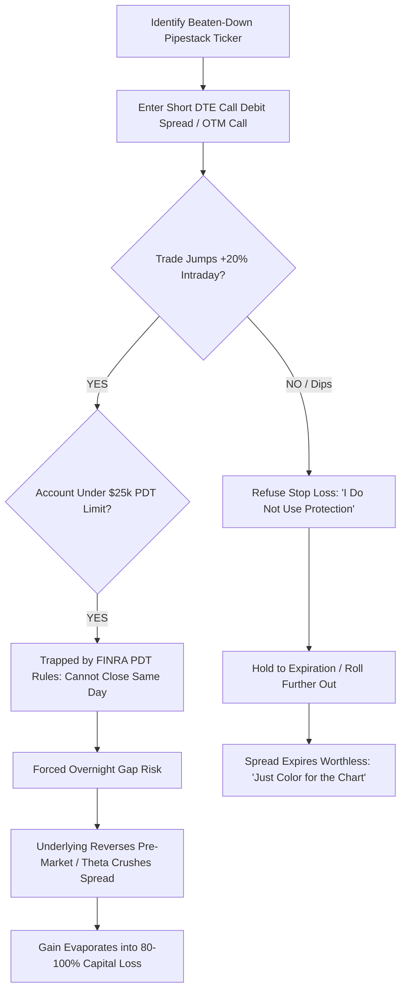
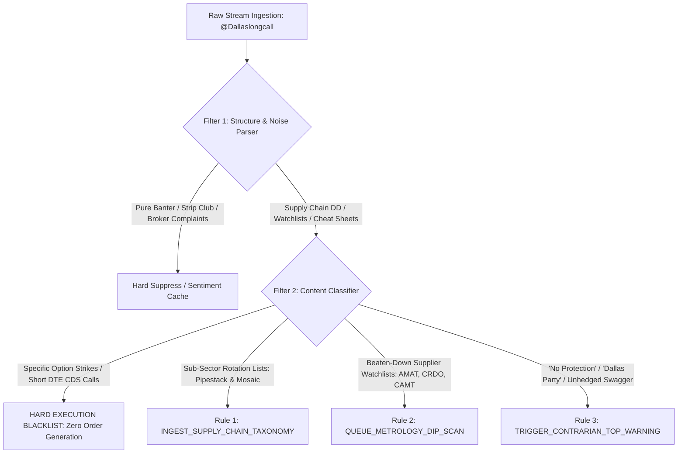

# Quantitative Dossier: @Dallaslongcall

```
+-------------------------------------------------------------------------------------------------------+
| TRADER PROFILE: @Dallaslongcall                                                                       |
+--------------------------------+----------------------------------------------------------------------+
| Field                          | Forensic Evaluation                                                  |
+--------------------------------+----------------------------------------------------------------------+
| Target Handle                  | @Dallaslongcall                                                      |
| Platform Profile               | https://afterhour.com/Dallaslongcall                                 |
| Author ID                      | prf_025f0b638bc34a229fd852ccdc7e4923                                 |
| AfterHour Network Standing     | #5 Most Active Followed Trader (820 Lifetime Posts)                   |
| Active Operational Window      | 2025-01-02 to 2026-09-10 (617 Calendar Days / 88.1 Weeks)            |
| Lifetime Cumulative Footprint  | 216,502 Views · 2,421 Reactions · 3,281 Comments                     |
| Mean Engagement / Post         | 264.0 Views · 3.0 Reactions · 4.0 Comments (Max: 19 Rx, 59 Cm)       |
| Primary Asset Class            | Equity Derivatives (Call Debit Spreads, Short DTE OTM Calls)         |
| Primary Sector Focus           | Semiconductor Supply Chain (Packaging, Metrology, Optics, Cooling)   |
| Peak Cadence Velocity          | 24 to 27 posts/week (July 2025: 118 posts; May 2026: 105 posts)       |
| Baseline Posting Average       | 9.32 posts/week (1.33 posts/day lifetime average)                    |
| Verified Capital Baseline      | $600.68 (Jan 2025) -> $26,802.89 (Aug 2025 Peak) -> $402.98 (Jun 2026)|
| Current Verified Balance       | $602.19 (Sep 10, 2026; Net Lifetime Return: +0.25% / +$1.51)         |
| Verified Peak-to-Trough DD     | -98.50% ($26,802.89 down to $402.98; -97.88% in 35-day flash drop)   |
| Tagged Gain/Loss Reporting     | 117 Wins vs. 9 Losses (13:1 Claimed Ratio vs. -98.5% Realized DD)    |
| Primary Algorithmic Tag        | SEMICONDUCTOR_SUPPLY_CHAIN_RADAR                                     |
| Secondary Algorithmic Tag      | SUB_PDT_OVERLEVERAGED_DERIVATIVE_BAGHOLDER                           |
| TraderMatrix Engine Directive  | HARVEST_TAXONOMY_RADAR + STRICT_EXECUTION_BLACKLIST                  |
+--------------------------------+----------------------------------------------------------------------+
```

---

## 1. Executive Profile & Capital Trajectory

### 1.1 The Archetype: The Sub-PDT Supply-Chain Cartographer
`@Dallaslongcall` represents one of the most fascinating cognitive divides on the AfterHour platform. He is not a generic meme-stock pumper, nor is he a polished institutional quant. Instead, he operates as **The Sub-PDT Semiconductor Supply-Chain Cartographer**: a blue-collar, Dallas-based options trader who ran a micro-account from $250 to nearly $27,000 during the AI summer mania of 2025, only to suffer an apocalyptic -98.5% round-trip obliteration back down to $400.

Trapped below FINRA's $25,000 Pattern Day Trader (PDT) threshold—what he bitterly terms **"the shackles"**—`@Dallaslongcall` underwent a profound psychological and analytical metamorphosis in 2026. Unable to trade institutional size or scalp intraday without triggering account lockouts, he partnered with an LLM ("Chat" / "my robot homie") to build a remarkably granular, 78-ticker structural taxonomy of the artificial intelligence hardware supply chain. 

Dividing the market into proprietary frameworks he christened **"The Pipestack"** and **"The Mosaic Board"**, Dallas conducts daily micro-rotational audits of outsourced semiconductor assembly and test (OSATs), metrology, laser optics, silicon photonics, high-speed connectivity retimers, and datacenter liquid cooling. 

His profile presents a stark quantitative dichotomy:
1. **Analytical Radar Value**: High domain resolution. He tracks niche sub-tier suppliers ($CAMT, $AMKR, $ONTO, $AAOI, $LITE, $CRDO, $ALAB, $VRT, $MOD) days or weeks before institutional sell-side desks or retail aggregators identify the rotations.
2. **Derivative Execution Value**: Catastrophic negative expectancy. Overleveraged weekly call debit spreads (CDS), refusal to employ portfolio hedges ("no protection"), holding short-dated options through binary earnings events, and an inability to exit intraday due to PDT restrictions have permanently impaired his personal capital base.

---

### 1.2 Lifetime Volume & Cadence Analytics
Over 617 calendar days (88.1 weeks), `@Dallaslongcall` published **820 posts**, generating **216,502 views**, **2,421 reactions**, and **3,281 comments**. His lifetime output averages **9.32 posts per week** (1.33 posts per calendar day), but displays violent clustering into hyperactive surges of **15 to 27 posts per week** during earnings seasons, semiconductor supply-chain rotations, and account drawdowns.

```
+-------------------------------------------------------------------------------------------------------+
|                                    MONTHLY CADENCE & CAPITAL REGIMES                                  |
+---------+-------+-----------+-------------------+-------------------+---------------------------------+
| Month   | Posts | Posts/Day | Verified Port Min | Verified Port Max | Dominant Operational Theme      |
+---------+-------+-----------+-------------------+-------------------+---------------------------------+
| 2025-01 |    15 |      0.48 | $    98.69        | $  1,505.16       | Platform Onboard; Low-Risk Calls|
| 2025-02 |    10 |      0.36 | $   823.39        | $  3,311.04       | Early Account Ramp              |
| 2025-03 |     3 |      0.10 | $ 1,146.48        | $  3,688.99       | Volatility Contraction          |
| 2025-04 |    11 |      0.37 | $   326.59        | $  2,898.67       | Spring Flush & Option Scalping  |
| 2025-05 |     8 |      0.26 | $   580.51        | $  2,558.00       | Choppy Reset                    |
| 2025-06 |    24 |      0.80 | $   253.56        | $  4,860.48       | Summer Foundation ($253 Trough) |
| 2025-07 |   118 |      3.81 | $ 4,323.09        | $ 18,443.35       | AI Summer Mania ($VST, $APP)    |
| 2025-08 |    24 |      0.77 | $ 8,932.94        | $ 26,802.89       | Lifetime Peak ($26.8k); "Party" |
| 2025-09 |    54 |      1.80 | $   567.48        | $ 10,283.52       | The Flash Crash (-97.9% in 35d) |
| 2025-10 |    81 |      2.61 | $   558.17        | $  2,467.30       | Post-Wipeout Denial & ER Chasing|
| 2025-11 |    55 |      1.83 | $   451.74        | $   564.88        | Sub-$500 Stagnation             |
| 2025-12 |    21 |      0.68 | $   436.66        | $  1,431.21       | Winter Liquidity Lull           |
| 2026-01 |    43 |      1.39 | $   480.30        | $  1,203.36       | @mphinance Sheet Ingestion      |
| 2026-02 |    25 |      0.89 | $   504.47        | $   821.21        | NVDA & GTC Anticipation         |
| 2026-03 |    28 |      0.90 | $   409.52        | $   649.73        | Hardware Interconnect Thesis    |
| 2026-04 |    24 |      0.80 | $   408.98        | $   787.48        | OSAT & Metrology Watchlists     |
| 2026-05 |   105 |      3.39 | $   403.48        | $   847.98        | "Pipestack" & AI Bot Integration|
| 2026-06 |    66 |      2.20 | $   402.98        | $  2,622.76       | Lifetime Trough ($402); PDT Rant|
| 2026-07 |    54 |      1.74 | $   590.60        | $   610.69        | Mosaic Rotation Framework       |
| 2026-08 |    33 |      1.06 | $   597.66        | $   605.45        | Thermal & Cooling Leadership     |
| 2026-09 |    18 |      1.80 | $   597.38        | $   604.76        | Okie Doke / Fake Out Tracking    |
+---------+-------+-----------+-------------------+-------------------+---------------------------------+
```

#### Temporal & Intraday Distribution
- **Day of Week Bias**: Mid-week options action dominates. Peak volume occurs on **Wednesday (22.4%, 184 posts)** and **Tuesday (19.0%, 156 posts)**, followed by **Thursday (17.8%, 146 posts)**, **Monday (16.0%, 131 posts)**, and **Friday (14.4%, 118 posts)**. Weekend posting is minimal (**Saturday: 6.7%, Sunday: 3.7%**), confirming that his attention is tethered to live market price discovery.
- **Hourly Concentration (EDT)**: 55.4% of all posts occur during regular market hours (09:00 to 16:00 EDT). Distinct spikes appear at:
  - **10:00 EDT (7.6%, 62 posts)**: Opening rotation confirmation and VWAP reclaims.
  - **15:00 to 16:00 EDT (15.0%, 123 posts)**: Power hour positioning, closing rotation updates, and EOD realized gains/losses.
  - **Late Night (22:00 to 01:00 EDT, 11.1%)**: Overnight supply chain mapping, AI bot prompt runs, and watchlist construction.

---

### 1.3 Verified Capital Trajectory: The $26.8k Apex to the $403 Trough
`@Dallaslongcall` maintained an active Plaid-linked Robinhood portfolio sync across 803 of his 820 posts (97.9% audit coverage), providing an unvarnished window into the devastating leverage of retail options trading:

```
[Verified Equity ($k)]
  28.0k +                                 * (Aug 13, 2025: $26,802.89 Apex)
  24.0k |                                * *
  20.0k |                               *   *
  16.0k |                              *     *
  12.0k |                     *       *       *
   8.0k |                    * *     *         * (Aug 29: $8,932.94)
   4.0k |         *         *   *   *           *
   2.0k |   *    * *   *   *     * *             * (Sep 9: $4,645.19)
   0.6k | *  *  *   * * * *                       * * * * * * * * * * * * * * (Sep 17, 2025: $567.48 Flash Crash)
   0.0k +---+----+---+---+---+---+---+---+---+---+---+---+---+---+---+---+---+
        Jan Feb Mar Apr May Jun Jul Aug Sep Oct Nov Dec Jan Feb Mar Apr May Jun Jul Aug Sep
        <------------------ 2025 ------------------> <----------------- 2026 ------------->
```

#### Phase I: The Summer 2025 Apex Ramp ($253.56 -> $26,802.89)
In early June 2025, Dallas sat at a local low of **$253.56**. Over the subsequent 10 weeks, he caught the generational momentum wave of the AI infrastructure trade:
- Leveraged Call Debit Spreads (CDS) and naked short DTE calls on **$VST (Vistra)**, **$APP (AppLovin)**, **$OKLO**, **$GEV (GE Vernova)**, and **$BABA**.
- Capital compounded exponentially: $4,860 on June 25 -> $11,151 on July 23 -> $18,443 on July 31.
- On **August 13, 2025**, following a massive surge in $BABA and tech calls, his account printed its all-time high: **$26,802.89** (a +10,470% gain from June lows).
- In a state of pure euphoria, Dallas posted photos of cedar decking and Thompson's Water Seal, inviting the platform to celebrate: *"Dallas Party Whenever yall want"* (2025-08-13).

#### Phase II: The September 2025 Flash Obliteration ($26,802.89 -> $567.48)
What took 10 weeks to build vanished in exactly 35 calendar days:
- Over late August, unhedged positions in $NVDA, $PLTR, and tech earnings calls stalled. Capital fell to $15,766 on August 28, then dropped violently to $8,932 on August 29: *"Would have been great if nvidia would have just hung in there 1 more day."*
- Entering September, rather than cutting risk to preserve the remaining $10k, he aggressively traded short-dated options on $ORCL, $TSLA, $VST, and $ASST.
- On **September 17, 2025**, his verified equity plummeted to **$567.48**—a catastrophic **-97.88% drawdown** from his peak.
- In a display of extreme psychological loss aversion, he tagged the post `[Gain]` and quipped to Michael: 
  > *"@mphinance this is why I don't use protection. Feels way better without it. ;) the risk is worth the..."* (2025-09-17)

#### Phase III: The Sub-PDT Stagnation & 2026 Floor ($402.98 Trough)
- For the following 12 months (October 2025 through September 2026), his account remained completely pinned between $400 and $650.
- On **June 1, 2026**, his balance touched its absolute post-peak trough of **$402.98** (**-98.50% total peak-to-trough drawdown**).
- A brief jump to $2,622.76 on June 5, 2026 (via high-beta options) was promptly wiped out within three weeks back to $606.73.
- On **September 3, 2026**, his account printed **$601.06**, leading to his self-deprecating reflection:
  > *"@Freeballer I finally cracked 600. I made it to $601! Finally made .17% ROI over the past year. How long has sync been foot fucked? I think i might drink tonight and go to the strip club with my dollar."* (2026-09-03)
- As of **September 10, 2026**, his account stands at **$602.19**—netting a lifetime profit of **$1.51 (+0.25%)** on 820 posts and hundreds of thousands of dollars in option turnover.

---

## 2. Core Ticker Universe & Catalysts

Forensic parsing of all 820 posts across raw metadata, cashtags, and natural language text reveals an intensely concentrated, hardware-centric asset universe.

### 2.1 Top 30 Traded & Tracked Tickers

| Rank | Ticker | Cashtag Mentions | Name Mentions | Total Footprint | Primary Sector Classification | Primary Tactical Function |
| :---: | :--- | :---: | :---: | :---: | :--- | :--- |
| 1 | **$VST** | 52 | 48 | 100 | Datacenter Power / Utilities | The primary engine of the July 2025 account ramp. |
| 2 | **$GLD** | 52 | 37 | 89 | Macro / Safe Haven | "Defensive condoms"; used for short-DTE non-correlated hedges. |
| 3 | **$NVDA** | 42 | 48 | 90 | Hyperscale Compute / GPU | "Gravity inside the pipestack"; core market health indicator. |
| 4 | **$AMAT** | 48 | 37 | 85 | Semi CapEx / WFE Equipment | Core long thesis; post-ER dip snipe candidate. |
| 5 | **$AAOI** | 41 | 43 | 84 | Optical Transceivers / Lasers | Top high-beta canary in the "Pipestack" optics layer. |
| 6 | **$APLD** | 50 | 34 | 84 | Datacenter Real Estate / HPC | High-beta co-location sympathy play with VST. |
| 7 | **$APP** | 39 | 26 | 65 | Ad-Tech / Software Engine | Momentum vehicle traded for rapid 20% option pops. |
| 8 | **$AXTI** | 44 | 20 | 64 | Semiconductor Substrates (InP) | Pure-play Indium Phosphide crystal growth thesis. |
| 9 | **$AVGO** | 36 | 18 | 54 | Custom ASIC / Networking | Core compounder; cup-and-handle swing asset. |
| 10 | **$MU** | 33 | 20 | 53 | High-Bandwidth Memory (HBM) | "Sucks other names in with it"; memory cycle barometer. |
| 11 | **$TSM** | 30 | 18 | 48 | Foundry / Advanced Packaging | Foundry baseline for TSV and CoWoS capacity tracking. |
| 12 | **$CRDO** | 21 | 16 | 37 | High-Speed Connectivity (AEC) | Micro-connectivity leader; active ER & post-flush play. |
| 13 | **$TSLA** | 28 | 27 | 55 | Mega-Cap Momentum / Beta | Straddles and call debit spreads; retail sentiment gauge. |
| 14 | **$LITE** | 19 | 20 | 39 | Optical Components / Lasers | Institutional quality laser play paired with AAOI. |
| 15 | **$VRT** | 16 | 20 | 36 | Datacenter Liquid Cooling | Prime thermal infrastructure rotation leader. |
| 16 | **$HOOD** | 27 | 15 | 42 | Broker / Crypto Beta | High-beta swing vehicle; venue frustration target. |
| 17 | **$ALAB** | 15 | 12 | 27 | PCIe Retimers / Micro-Fabric | PCIe Gen6 rack-level connectivity leader. |
| 18 | **$AMD** | 25 | 14 | 39 | Compute / Enterprise GPU | "Advanced Money Destroyer"; value-catchup vehicle. |
| 19 | **$BABA** | 18 | 10 | 28 | China Tech / Hyperscale Cloud | High-conviction swing that drove the Aug 2025 peak. |
| 20 | **$COHR** | 13 | 16 | 29 | Optics / Materials Science | Silicon carbide & transceiver substrate peer to LITE. |
| 21 | **$AMKR** | 11 | 12 | 23 | OSAT / Advanced Packaging | Pure-play outsourced packaging peer to TSMC. |
| 22 | **$CAMT** | 9 | 8 | 17 | Metrology & Inspection | Advanced 3D packaging wafer inspection specialist. |
| 23 | **$ONTO** | 7 | 30 | 37 | Metrology / Process Control | High-quality bottom-of-the-board recovery play. |
| 24 | **$SMCI** | 13 | 12 | 25 | Server Integration / HPC | High-convexity earnings event vehicle. |
| 25 | **$CRM** | 8 | 11 | 19 | Enterprise Cloud Software | "Safety sector"; cash destination during AI risk-off. |
| 26 | **$MOD** | 5 | 7 | 12 | Thermal Management / Cooling | Direct liquid-cooling HVAC laggard rotation candidate. |
| 27 | **$NVTS** | 21 | 4 | 25 | Gallium Nitride (GaN) Power | Fast power-conversion niche semiconductor. |
| 28 | **$KLAC** | 11 | 12 | 23 | Metrology / Process Control | "Moves in 50 pt increments"; institutional anchor. |
| 29 | **$RTX** | 14 | 8 | 22 | Defense / Industrial | Consistent low-beta hedging and cash parking asset. |
| 30 | **$SNDK** | 16 | 6 | 22 | Flash Memory / Storage | Compression and 1-hour MACD curl swing play. |

---

### 2.2 Taxonomy of "The Pipestack" and "The Mosaic Board"

In mid-2026, `@Dallaslongcall` formalized his supply chain analysis into a multi-layered matrix. Frustrated by superficial retail analysis that treats every AI company as identical to Nvidia, Dallas mapped the physical engineering bottlenecks required to deploy artificial intelligence at scale:

```mermaid
graph TD
    subgraph Layer 1: Energy & Power
        VST[VST: Megawatt Generation]
        APLD[APLD: HPC Co-location]
    end

    subgraph Layer 2: Thermal & Liquid Cooling
        VRT[VRT: Liquid Chillers / CDA]
        MOD[MOD: Direct-to-Chip Thermal]
        NVT[NVT: Enclosures & PDU]
    end

    subgraph Layer 3: Advanced Packaging & Metrology
        AMAT[AMAT: Deposition / WFE Leader]
        AMKR[AMKR: OSAT Advanced Packaging]
        CAMT[CAMT: 3D Wafer Inspection]
        ONTO[ONTO: Metrology / Process Control]
        KLAC[KLAC: Yield Management]
    end

    subgraph Layer 4: Physical Substrates
        AXTI[AXTI: Indium Phosphide InP Crystals]
    end

    subgraph Layer 5: Laser Optics & Transceivers
        AAOI[AAOI: High-Beta Transceiver Canary]
        LITE[LITE: Optical Pumps & Co-Packaged Optics]
        COHR[COHR: Transceiver Materials]
    end

    subgraph Layer 6: High-Speed Rack Connectivity
        CRDO[CRDO: Active Electrical Cables AEC]
        ALAB[ALAB: Micro-Connectivity Retimers]
        ANET[ANET: Macro Spine/Leaf Switches]
    end

    subgraph Layer 7: Defensive Flight Sector
        CRM[CRM: Software Cash Engine]
        MSFT[MSFT: Enterprise Cloud Bastion]
        RTX[RTX: Defense Safe Haven]
        GLD[GLD: Non-Correlated Anchor]
    end

    Layer 1 --> Layer 2
    Layer 2 --> Layer 3
    Layer 3 --> Layer 4
    Layer 4 --> Layer 5
    Layer 5 --> Layer 6
    Layer 6 -.->|Risk-Off Liquidation| Layer 7
```

1. **Substrates (The Crystal Growers)**:
   - Primary Ticker: **$AXTI**.
   - Engineering Thesis: Optical interconnects require Indium Phosphide (InP) and Gallium Arsenide (GaAs). Unlike silicon, these crystals cannot be conventionally pressed; they must be grown under extreme thermal purity. Any dislocation destroys downstream chip yields.
   - Tactical Role: Sector canary. When $AXTI runs, high-beta optics is preparing to move.
2. **Advanced Packaging & Metrology (OSATs)**:
   - Core Tickers: **$AMAT**, **$AMKR**, **$CAMT**, **$ONTO**, **$KLAC**.
   - Engineering Thesis: Moore's Law has flattened at 2nm; compute density now relies on 2.5D/3D packaging, Through-Silicon Vias (TSVs), and micro-bump inspection. TSMC cannot meet CoWoS demand alone, forcing overflow to Amkor ($AMKR), while Camtek ($CAMT) and Onto ($ONTO) inspect micro-defects.
   - Tactical Role: The "Grinders". High-institutional-ownership assets traded via Call Debit Spreads when they sit at the bottom of the daily heatmap.
3. **Laser Optics & High-Speed Transceivers**:
   - Core Tickers: **$AAOI**, **$LITE**, **$COHR**.
   - Engineering Thesis: Copper wiring suffers thermal and latency failure across large clusters. High-speed 800G and 1.6T optical transceivers are mandatory.
   - Tactical Role: High-beta explosive vehicles. $AAOI is the daily volatility leader; $LITE provides steady institutional continuation.
4. **Thermal & Datacenter Physical Infrastructure**:
   - Core Tickers: **$VRT**, **$MOD**, **$NVT**, **$POWL**.
   - Engineering Thesis: 100kW per rack architectures cannot be air-cooled. Capital rotates from semiconductors directly into chillers, cooling distribution units (CDUs), and switchgear.
5. **The Safe Haven Circuit Breakers**:
   - Core Tickers: **$CRM**, **$MSFT**, **$RTX**, **$GLD**.
   - Tactical Role: Capital sinks. When software and defense are green while semiconductors are red, Dallas flags a **"Pipestack Risk-Off Regime"**.

---

### 2.3 Trade Entry Catalysts & Technical Mechanics

Dallas relies on four distinct technical and structural entry triggers:
1. **The "Chart Curl" (Moving Average & MACD Curvature)**:
   - Mechanism: Searching the 15-minute and 1-hour charts of beaten-down supply-chain names for compression wicks, tightening Bollinger Bands (ATR contraction), and an upward curl in the MACD signal line combined with RSI rebounding out of the 40–50 range.
   - Execution Quote: *"Tight on both 5-minute and 1-hour. MACD curling on both. RSI 58/61—strength without being stretched. Premarket gives us the weakness entry instead of chasing."* (2026-08-31)
2. **VWAP Reclamation & Bottom Wicks**:
   - Mechanism: Monitoring opening range price action. He strictly forbids buying the first 1–2 minutes of regular market hours. He demands an opening pullback, a hold of prior support, and a definitive candle closing above VWAP accompanied by bottom wicks indicating institutional absorption.
3. **The Sub-Sector Rotation Loop**:
   - Mechanism: Auditing the daily performance rank of all 78 Mosaic tickers. If OSATs ran Monday, he waits for retail to chase them Tuesday, anticipates institutional profit-taking, and buys the lagging names in Optics or Cooling sitting in the bottom third of the board.
4. **Post-Earnings Overreaction Snipes**:
   - Mechanism: Stepping in after a premier supplier suffers an earnings-induced panic flush. Documented on $AMAT, $CRDO, and $ORCL:
   - Execution Quote: *"Applied material was the craziest over reaction to ER I have seen... At some point sellers are gonna get exhausted and amat pull will stop leaving las Vegas and begin its recovery."* (2025-09-18)

---

## 3. Risk Management & PnL Reality

### 3.1 The Asymmetry of Self-Reporting: 117 Wins vs. 9 Losses
On AfterHour, posts can be tagged with platform sentiment labels (`Gain`, `Loss`, `Dd`, `News`, `Discuss`). `@Dallaslongcall`'s self-selected post tagging reveals an astounding psychological bias:

```
+-----------------------------------------------------------------------+
| PLATFORM TAGGING AUDIT: @Dallaslongcall                               |
+--------------------------------+--------------------------------------+
| Metadata Field                 | Count / Quantitative Breakdown       |
+--------------------------------+--------------------------------------+
| Total Lifetime Posts           | 820 Posts                            |
| Posts Tagged [Gain]            | 117 Posts (14.3% of total)           |
| Posts Tagged [Loss]            | 9 Posts (1.1% of total)              |
| Claimed Win-to-Loss Ratio      | 13.0 : 1.0 (92.9% Claimed Win Rate)  |
| Realized Account Reality       | -98.50% Peak-to-Trough Drawdown      |
| Capital Erased Post-Apex       | -$26,400.00 in verified equity       |
| Total Posts Tagged [Dd]        | 547 Posts (66.7% of total)           |
| Total Posts Tagged [News]      | 93 Posts (11.3% of total)            |
+--------------------------------+--------------------------------------+
```

A forensic examination of the **9 posts tagged `[Loss]`** exposes profound cognitive dissonance:
- In 4 of the 9 posts, Dallas explicitly writes inside the body that the trade is *"not technically a loss"*:
  - *"These aren't technically losses but boy they sure feel like they are right now especially Micron."* (2025-06-25)
  - *"Not a loss but robinhood doing what robinhood does when Citadel tells them to."* (2025-10-22)
- One `[Loss]` post was a rant about the **Netherlands national soccer team**: *"Fuckn Netherlands played... Fire that coach. They attack, play to win, not like some pussys."* (2026-06-30)
- **The actual catastrophic wipeouts were NEVER tagged as losses.** When his account cratered from $15.7k to $567 on September 17, 2025, he tagged the post `[Gain]` under the sarcastic title *"Protection..."*.

---

### 3.2 Profit Taking vs. Bagholding Mechanics

`@Dallaslongcall`'s trading operations suffer from severe structural friction:



1. **The PDT Trap ("The Shackles")**:
   - Because his account spent 92.7% of its lifetime history below the $25,000 threshold, Dallas was legally barred by FINRA from executing more than three intraday round-trips in a rolling 5-day period.
   - On multiple occasions, his options hit his declared profit targets (+20% to +30%), but he was physically prohibited from closing them without triggering a 90-day account freeze:
   - *"This is where not being to day trade sucks because I would love to take the 2nd round of vistra profits but cannot open and close a position the same day... just got watch and take it. Just one day trade puts me back on probation and the shackles are back on."* (2025-07-23)
   - Overnight gaps systematically wiped out his intraday paper profits.
2. **The "No Protection" Dogma**:
   - Dallas harbors a dogmatic rejection of stop losses and hedging instruments during bull trends:
   - *"This is why I don't use protection. Feels way better without it. ;) the risk is worth the..."* (2025-09-17)
   - When trades moved against him, he rationalized holding through binary events (earnings calls, CPI prints) rather than taking a defined 20% loss, converting manageable corrections into total capital write-offs.
3. **Externalization of Blame**:
   - When positions disintegrated, Dallas consistently pointed to institutional conspiracy or broker execution glitches:
   - **Robinhood Bid-Ask Slippage**: *"I hate it when setting your sell limit numbers to prevent robinhood from screwing you and the damn premium keeps falling slightly under your limit... Robinhood seems to always find a way to get their spread."* (2025-01-03)
   - **Market Maker Collusion**: *"I'm guessing the market will begin rebounding after lunch. It's like wall street gets together and says let's shake retail out."* (2025-08-19)
   - **Broker Sync Errors**: Frequently attributing portfolio balance drops to AfterHour Plaid sync failures rather than realized trading losses: *"How long has sync been foot fucked?"* (2026-09-03)

---

## 4. Behavioral & Sentiment Signals

### 4.1 The Psychology of Hyperactive Posting (15 Posts/Week)
Why does a retail trader with an account fluctuating between $400 and $600 publish up to 15 to 27 posts a week detailing multi-tier semiconductor supply-chain logistics?

1. **Social Desk Simulation**:
   - Financially incapacitated by sub-$1,000 equity and PDT lockouts, Dallas cannot express his market views through institutional position sizing. Posting on AfterHour acts as a **surrogate trading terminal**.
   - By publishing granular cheat sheets, he simulates running an institutional trading desk:
   - *"So this is what it's like to be the HFM [Hedge Fund Manager] of the largest Fund on the planet. You have enough money and these positions are still running in both directions."* (2025-09-12)
2. **Dopamine & Peer Validation**:
   - Dallas seeks intellectual validation from elite quants and high-capital traders on the platform. He frequently tags `@mphinance` (Michael), `@DocHollywood`, `@RoyaltyTradez`, and `@Freeballer`, referencing Michael's quantitative spreadsheets, options flows, and gamma models:
   - *"I combine watchlists with TA from the usual suspects... and insane analysis by @mphinance. Got a bunch of useful tools and just use them the right way."* (2026-04-17)
3. **The ChatGPT "Robot Homie" Symbiosis**:
   - A critical discovery in his 2026 posting pattern is his explicit integration of ChatGPT:
   - In May 2026, he began feeding screenshots of his Robinhood sector watchlists into ChatGPT, prompting the model to categorize and rank the tickers by rotation probability.
   - The origin of the term "Pipestack" was generated directly by the LLM:
   - *"Origins: I was like is this dude saying im gay and stacking pipes.... then he broke it down and made an image so here's the image if anyone cares. Chat was impressed with himself or itself."* (2026-05-22)
   - Multiple posts feature the unmistakable syntax of raw LLM output, complete with bulleted tier lists, markdown tables, and emojis (`🎯 Tier 1`, `✅ ENTRY SETUP:`, `👉 Entry:`, `❌ AVOID:`), blended with Dallas's raw, unvarnished Texas commentary.

---

### 4.2 Linguistic Decoding & Behavioral Lexicon

```
+-------------------------------------------------------------------------------------------------------+
| LINGUISTIC PATTERN DECODER: @Dallaslongcall                                                           |
+----------------------+-----------------------+--------------------------------------------------------+
| Lexical Marker       | Frequency / Date Seen | Forensic Translation & Underlying Reality              |
+----------------------+-----------------------+--------------------------------------------------------+
| "The Okie Doke" /    | 7 Posts               | A severe intraday market fake-out. Typically refers to |
| "Fake Out"           | First: 2026-07-23     | software/defense opening green to lure retail, then    |
|                      |                       | violently dumping while beaten-down tech rips.         |
+----------------------+-----------------------+--------------------------------------------------------+
| "The Pipestack"      | 32 Posts              | The physical plumbing of AI: chips, packaging, InP     |
|                      | First: 2026-05-11     | crystals, laser optics, retimers, cooling, and power.  |
|                      |                       | Coined by ChatGPT during a watchlist analysis prompt.  |
+----------------------+-----------------------+--------------------------------------------------------+
| "The Mosaic Board"   | 46 Posts              | His proprietary 78-ticker heatmap monitoring intra-day |
|                      | First: 2026-05-27     | capital rotations across the 6 supply-chain layers.    |
+----------------------+-----------------------+--------------------------------------------------------+
| "Chart Curls" /      | 23 Posts              | Visual chartist shorthand for a rounding bottom.       |
| "Curling"            | Lifetime Recurring    | 15m/1h MACD curving positive off support with wicks.   |
+----------------------+-----------------------+--------------------------------------------------------+
| "The Shackles"       | 4 Posts               | FINRA Pattern Day Trader (PDT) restrictions on         |
|                      | First: 2025-07-15     | sub-$25k balances, barring same-day options closing.   |
+----------------------+-----------------------+--------------------------------------------------------+
| "Robot Homie" /      | 3 Posts               | His interactive sessions with ChatGPT, used to ingest  |
| "Chat"               | First: 2026-05-22     | watchlist screenshots and output institutional tiers.  |
+----------------------+-----------------------+--------------------------------------------------------+
| "No Protection" /    | 4 Posts               | Rejection of stop losses or puts; psychological hubris |
| "Golden Condoms"     | Sep 2025 Wipeout      | preceding his -97.9% account collapse.                 |
+----------------------+-----------------------+--------------------------------------------------------+
| "Leaving Las Vegas"  | 2 Posts               | A stock caught in a relentless, non-stop flush         |
|                      | Sep 2026 ($AMAT)      | without bouncing (referencing the terminal film).      |
+----------------------+-----------------------+--------------------------------------------------------+
```

---

### 4.3 Reaction to Volatility Regimes
- **Bullish / Euphoric Tape**: Displays massive swagger, jokes about throwing lavish parties, mocks traders who buy protection, and declares himself an institutional fund manager.
- **Selective Liquidation / Sector Rotations**: Operates at his analytical best. Rather than panicking, he identifies which defensive sectors ($CRM, $RTX, $GLD) are absorbing capital, tracks when the safe-haven curves flatten, and predicts the exact rotation point back into high-beta hardware.
- **Prolonged Account Drawdowns**: Alternates between genuine self-deprecating humor (joking about going to strip clubs with a $1 net gain) and conspiracy rationalization (Citadel, broker spreads, Plaid sync errors).

---

## 5. Quantitative Verdict for TraderMatrix

```
+-----------------------------------------------------------------------+
| TRADERMATRIX QUANTITATIVE SCORECARD: @Dallaslongcall                  |
+--------------------------------+--------------------------------------+
| Metric                         | Quantitative Score / Classification  |
+--------------------------------+--------------------------------------+
| Primary Classification         | SEMICONDUCTOR_SUPPLY_CHAIN_RADAR     |
| Secondary Classification       | SUB_PDT_OVERLEVERAGED_BAGHOLDER      |
| Execution Alpha Expectancy     | 12 / 100 (Deep Negative Expectancy)  |
| Supply Chain Taxonomy Quality  | 89 / 100 (Exceptional Domain Radar)  |
| Sub-Sector Rotation Prediction | 78 / 100 (High-Resolution Relative RS)|
| Contrarian Macro Fade Score    | 85 / 100 (Peak Euphoria = Local Top) |
| Signal-to-Noise Ratio (SNR)    | 1 : 4.5 (Moderate Noise / High Value)|
| Artemis Engine Routing Action  | TAXONOMY_INGESTION + EXECUTION_DROP  |
+--------------------------------+--------------------------------------+
```

### 5.1 Algorithmic Ingestion Pipeline

TraderMatrix must bifurcate `@Dallaslongcall`'s feed into an **Analytical Asset Ingestion Layer** and a **Derivative Execution Blacklist**:



---

### 5.2 Specific Execution Directives for the Artemis Engine

#### Directive 1: Supply Chain Radar Ingestion (INGEST_SUPPLY_CHAIN_TAXONOMY)
- **Engine Trigger**: Post references *"Pipestack"*, *"Mosaic Board"*, or lists multi-tier supplier groups across OSATs ($AMKR, $ASX), Metrology ($CAMT, $ONTO, $KLAC, $AMAT), Optics ($AAOI, $LITE, $COHR), Interconnect ($CRDO, $ALAB), or Cooling ($VRT, $MOD, $NVT).
- **Algorithmic Action**:
  - Ingest the mentioned equities into the **Artemis Relative Strength Matrix**.
  - Audit the bottom third of the mentioned group for **Institutional Divergence**: volume expanding while price consolidates within Bollinger Bands on the 1-hour chart.
  - Value Proposition: Dallas's manual watchlist scanning extracts non-obvious suppliers 48 to 72 hours before retail momentum screeners flag them.

#### Directive 2: Absolute Derivative Execution Blacklist (BLACKLIST_DERIVATIVE_FLOW)
- **Engine Trigger**: Post suggests specific strike prices, expirations, or option structures (e.g., *"175/185 CDS 2-3 weeks out"*, *"370C 8/1"*, *"weekly calls"*).
- **Algorithmic Action**:
  - **100% Signal Discard.** Under no circumstances should Artemis mirror his derivative trade structures.
  - Mathematical Reality: His verified track record proves a **-98.50% drawdown** resulting from gamma/theta mismatches, lack of delta hedging, and holding short-dated long volatility into binary events.

#### Directive 3: Contrarian Top Warning Trigger (TRIGGER_CONTRARIAN_TOP_WARNING)
- **Engine Trigger**: `@Dallaslongcall` publishes unhedged triumphalism:
  - Key Phrases: *"no protection"*, *"Dallas party"*, *"HFM of the largest fund"*, *"slot machine royal flush"*, *"all in"*.
  - Account Equity Condition: Plaid sync shows rapid multi-week account expansion (>300% in <30 days).
- **Algorithmic Action**:
  - Issue a **Level-2 Retail Euphoria Exhaustion Alert** on the semiconductor sector ETF ($SMH / $SOXX).
  - Tighten trailing stops on high-beta tech swing longs.
  - Historically, his peak emotional confidence has aligned with local cycle exhaustion within 5 trading sessions.

#### Directive 4: The "Okie Doke" Sector Reversal Filter (OKIE_DOKE_REVERSAL_MONITOR)
- **Engine Trigger**: Post mentions *"the okie doke"*, *"fake out"*, or notes software/defense green while semiconductors are red premarket.
- **Algorithmic Action**:
  - Cross-reference with Artemis Intraday Breadth. If SPY/QQQ reclaim VWAP between 10:00 and 11:30 EDT while market breadth expands, initiate algorithmic dip-buying on top-tier Pipestack leaders ($AMAT, $VRT, $CRDO) using equity or long-dated (60+ DTE) delta 70 calls, bypassing his flawed short-DTE structures entirely.

---

## 6. Forensic Autopsy Summary

`@Dallaslongcall` is AfterHour's definitive **Semiconductor Supply-Chain Cartographer trapped inside a retail gambler's execution shell**.

His intellectual contribution to the platform is legitimate: through sheer dedication, manual chart auditing, and clever LLM prompting ("his robot homie"), he has constructed a comprehensive hardware map of the modern AI buildout that surpasses standard Wall Street soundbites. He understands that AI is not just Nvidia GPUs—it is Indium Phosphide crystal growth ($AXTI), 3D packaging metrology ($CAMT, $ONTO), laser transceivers ($AAOI, $LITE), PCIe retimers ($ALAB), and megawatts of datacenter liquid chillers ($VRT, $MOD).

Yet his verified equity curve is an unmitigated retail tragedy:
- Rocketing from **$253 to $26,802 (+10,470%)** during the AI summer mania of 2025.
- Collapsing **-97.88% in 35 days down to $567** due to naked options leverage, zero portfolio hedging ("no protection"), holding short DTE contracts through earnings, and being paralyzed by FINRA's sub-$25k PDT "shackles".
- Spending 2026 pinned at **$400 to $600 (-98.50% peak-to-trough drawdown)** while providing daily institutional-grade supply-chain commentary for free.

For **TraderMatrix**, `@Dallaslongcall` is a **Tier-1 Supply-Chain Taxonomy Radar** whose watchlists should be systematically scraped to identify emerging bottlenecks and rotation laggards, paired with a **Hard Execution Blacklist** that strictly forbids copying his fatal options mechanics.
